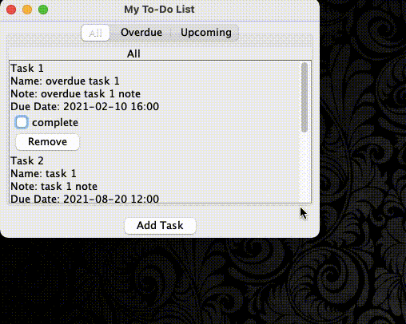

# Task Manager

- Created a task manager in Java.
- The app allows user to add task, list out tasks, and remove tasks.
- It'll list out tasks that are overdue or upcoming.
- It allows user to input their task in the app.

## Features

* List all tasks

* Add a new task
    - date input is using the LGoodDatePicker library

* Remove a task

* Mark a task as completed/incomplete

* List overdue incomplete tasks

* List upcoming incomplete tasks

## Demo

